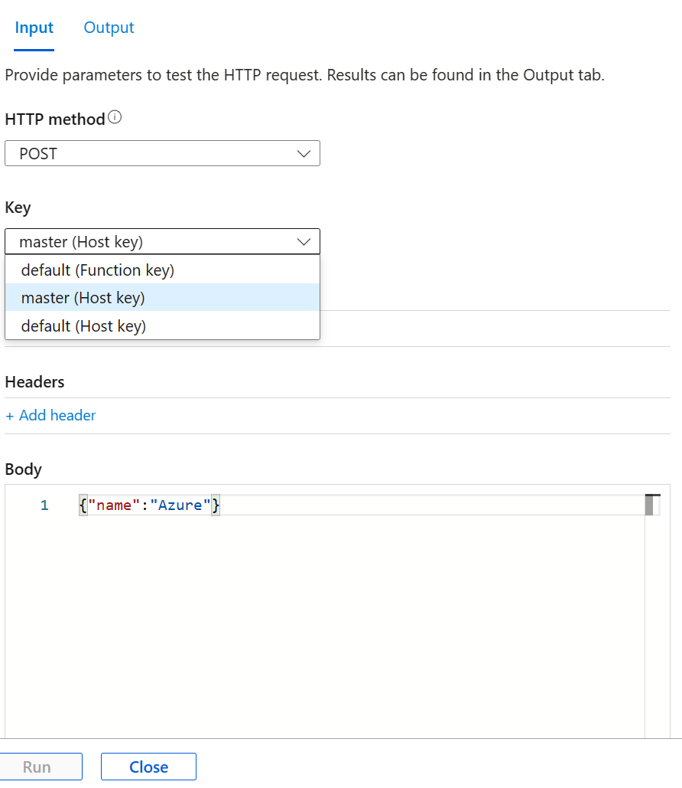

### Function Keys

HTTP triggered functions unless set to ```anonymous```, requests must include API access key in request.

**Function:** These keys apply only to the specific functions under which they're defined. When used as an API key, these only allow access to that function.

**Host:** Keys with a host scope can be used to access all functions within the function app. When used as an API key, these allow access to any function within the function app.

Each key is named for reference, and there's a default key (named "default") at the function and host level. Function keys take precedence over host keys. When two keys are defined with the same name, the function key is always used.


